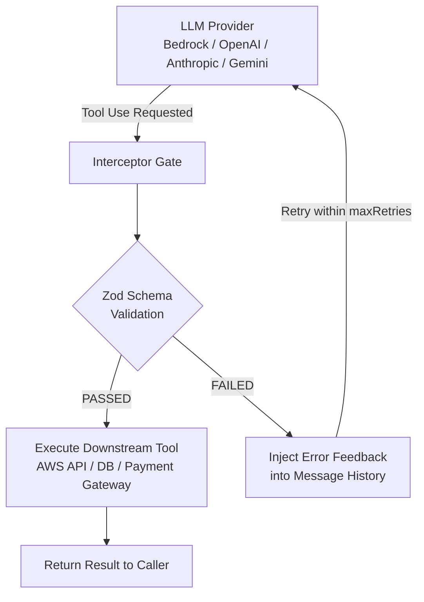

# 🛡️ Agentic Deterministic State Engine

> **A production-ready, model-agnostic proxy engine that enforces strict runtime execution bounds, schema validation gates, and self-correction loops for LLM Function Calling.**

[](https://www.npmjs.com/package/agentic-gate)
[](https://www.npmjs.com/package/agentic-gate)
[](https://nodejs.org/)
[](https://aws.amazon.com/bedrock/)
[](https://zod.dev/)
[](https://opensource.org/licenses/MIT)

---

## 📌 Problem Statement

LLM Agentic Function Calling (Tools) is inherently non-deterministic:
* **Hallucinated Arguments:** Models frequently output invalid parameters (e.g., non-existent regions, malformed UUIDs, out-of-bound dates).
* **Infinite Loops:** When a tool call fails, agents often re-issue the exact same broken payload indefinitely.
* **Unsafe Execution:** Executing unvalidated tool calls directly against downstream infrastructure (AWS, SQL databases, payment gateways) risks severe operational failure.

---

## 💡 Solution Architecture

This repository implements a **Deterministic State Engine** sitting between the user/application and downstream infrastructure tools. It intercepts every tool invocation requested by the LLM, passes it through a local **Zod Schema Validation Gate**, and manages a stateful retry loop with error feedback injection.

```
                      ┌─────────────────────────────────┐
                      │    User Input / System Prompt   │
                      └────────────────┬────────────────┘
                                       │
                                       ▼
                      ┌─────────────────────────────────┐
                      │   LLM Provider (Bedrock/OpenAI) │
                      └────────────────┬────────────────┘
                                       │
                                       ▼  (Tool Use Requested)
                      ┌─────────────────────────────────┐
                      │    DETERMINISTIC STATE ENGINE   │
                      │                                 │
                      │   ┌─────────────────────────┐   │
                      │   │  Zod Validation Gate    │   │
                      │   └────────────┬────────────┘   │
                      └────────────────┼────────────────┘
                                       │
                     ┌─────────────────┴─────────────────┐
                     │                                   │
             [Schema PASSED]                     [Schema FAILED]
                     │                                   │
                     ▼                                   ▼
        ┌─────────────────────────┐         ┌─────────────────────────┐
        │  Execute Downstream API │         │ Inject Error Feedback   │
        │  (AWS EC2, DB, etc.)    │         │ into Message History    │
        ┌─────────────────────────┐         └────────────┬────────────┘
                     │                                   │
                     ▼                                   ▼
        ┌─────────────────────────┐         ┌─────────────────────────┐
        │     Return Success      │         │ Loop (Max Retries Check)│
        └─────────────────────────┘         └─────────────────────────┘
```



---

## Key Features

* 🛡️ **Zero-Trust Validation Gate:** Uses Zod schemas to intercept and validate parameters locally *before* hitting downstream APIs.
* 🔄 **Self-Correction Feedback Loop:** Feeds exact schema validation error traces back into the conversation history, allowing the LLM to self-correct in subsequent attempts.
* ⚡ **Circuit Breaker:** After `maxConsecutiveFailures` (default `3`) failures in a row for the same tool, the gate trips and rejects further calls *before* touching the schema or `execute()` — stopping runaway LLM retry loops without your own bookkeeping. Reset with `gate.resetCircuit(toolName)`.
* 📡 **Telemetry Hooks:** `onGateSuccess` / `onGateFailure` callbacks fire on every call, so you can export metrics to OpenTelemetry, Datadog, CloudWatch, or plain logs.
* 🔍 **Async External-State Validation:** Add an optional `validate()` hook per tool to check real external state (e.g. does this EC2 instance ID actually exist) before `execute()` runs — a rejected `validate()` counts as a gate failure just like a schema mismatch.
* 🔌 **Provider-Agnostic Design:** Decoupled architecture support for **AWS Bedrock**, **OpenAI**, **Anthropic**, and **Google Gemini**.
* 🔑 **Zero Secrets Leakage:** Native integration with local AWS credentials (`aws configure`) or environment variables.

---

## 🏗️ Engine Sequence Diagram

```
User               Engine             Zod Gate           Bedrock / LLM         AWS API
 │                    │                   │                    │                  │
 │─ Send Prompt ─────>│                   │                    │                  │
 │                    │── Converse API ───────────────────────>│                  │
 │                    │<── Tool Request ("restart_ec2") ───────│                  │
 │                    │                   │                    │                  │
 │                    │── Validate Input >│                    │                  │
 │                    │<─ FAILED (Region)─│                    │                  │
 │                    │                   │                    │                  │
 │                    │── Append Tool Error & Retry Loop ─────>│                  │
 │                    │<── Self-Corrected Text Response ───────│                  │
 │                    │                   │                    │                  │
 │<─ Return Result ───│                   │                    │                  │
```

---

## 🛠️ Multi-AI Provider Extensibility

While the core implementation uses **AWS Bedrock Converse API**, the state engine and validation gates are completely provider-agnostic. 

Below is how the exact same validation engine wraps other AI providers:

### 1. AWS Bedrock (Default Implementation)
```javascript
import { BedrockRuntimeClient, ConverseCommand } from "@aws-sdk/client-bedrock-runtime";

const response = await bedrockClient.send(new ConverseCommand({
  modelId: "us.anthropic.claude-haiku-4-5-20251001-v1:0",
  messages: messages,
  toolConfig: toolConfig
}));
```

### 2. OpenAI (`openai` Package)
```javascript
import OpenAI from "openai";
const openai = new OpenAI();

const response = await openai.chat.completions.create({
  model: "gpt-4o",
  messages: messages,
  tools: toolsSpec
});

const toolCall = response.choices[0].message.tool_calls?.[0];
const validation = EC2RestartSchema.safeParse(JSON.parse(toolCall.function.arguments));
```

### 3. Anthropic Native (`@anthropic-ai/sdk`)
```javascript
import Anthropic from "@anthropic-ai/sdk";
const anthropic = new Anthropic();

const response = await anthropic.messages.create({
  model: "claude-3-5-sonnet-20241022",
  messages: messages,
  tools: toolsSpec
});

const toolCall = response.content.find(c => c.type === "tool_use");
const validation = EC2RestartSchema.safeParse(toolCall.input);
```

### 4. Google Gemini (`@google/genai`)
```javascript
import { GoogleGenAI } from "@google/genai";
const ai = new GoogleGenAI({ apiKey: process.env.GEMINI_API_KEY });

const response = await ai.models.generateContent({
  model: "gemini-3.6-flash",
  contents,
  config: { tools: [{ functionDeclarations: [restartEc2Declaration] }] }
});

const call = response.functionCalls[0];
const validation = EC2RestartSchema.safeParse(call.args);
```

---

## 🚀 Quick Start

### 1. Install
```bash
npm install agentic-gate zod
```

### 2. Register a tool and intercept a call
This is the core API — provider-agnostic, no AWS/network calls required:

```javascript
import { AgenticGate } from "agentic-gate";
import { z } from "zod";

const gate = new AgenticGate();

gate.registerTool({
  name: "restart_ec2_instance",
  schema: z.object({
    instanceId: z.string().regex(/^i-[a-f0-9]{8,17}$/, "Invalid AWS EC2 Instance ID format"),
    region: z.enum(["us-east-1", "us-west-2", "ap-south-1"]),
  }),
  execute: async ({ instanceId, region }) => {
    // Your real downstream call (AWS SDK, DB, HTTP, etc.)
    return { status: "success", instanceId, region };
  },
});

// Feed it raw, untrusted arguments straight from the LLM's tool-call payload
const result = await gate.interceptAndExecute("restart_ec2_instance", {
  instanceId: "i-0123456789abcdef0",
  region: "eu-central-1", // not in the enum -> gate rejects before execute() runs
});

if (!result.success) {
  console.log(result.error);
  // "[Validation Gate Failed]: region: Invalid enum value..."
  // Feed this string back into the LLM's message history so it can self-correct.
}
```

### 3. Circuit breaker + telemetry
Configure both when constructing the gate:

```javascript
const gate = new AgenticGate({
  maxConsecutiveFailures: 3, // 0 disables the breaker
  onGateFailure: (e) => metrics.increment(`gate.failure.${e.reason}`, { tool: e.toolName }),
  onGateSuccess: (e) => metrics.increment("gate.success", { tool: e.toolName }),
});

// After 3 consecutive failures for "restart_ec2_instance", the gate short-circuits:
// { success: false, error: "[Circuit Breaker OPEN]: Tool 'restart_ec2_instance' has failed 3 consecutive times..." }

gate.resetCircuit("restart_ec2_instance"); // once the underlying issue is fixed
```

### 4. Async external-state validation
Zod only checks the *shape* of the arguments — it can't tell you whether
`i-0123456789abcdef0` is an EC2 instance that actually exists. For that, add
a `validate()` hook: it runs after the schema passes and before `execute()`,
and throwing rejects the call exactly like a schema failure (same circuit
breaker, same telemetry, reason `"async-validation"`):

```javascript
import { EC2Client, DescribeInstancesCommand } from "@aws-sdk/client-ec2";
const ec2 = new EC2Client({});

gate.registerTool({
  name: "restart_ec2_instance",
  schema: z.object({
    instanceId: z.string().regex(/^i-[a-f0-9]{8,17}$/),
    region: z.enum(["us-east-1", "us-west-2", "ap-south-1"]),
  }),
  validate: async ({ instanceId, region }) => {
    const { Reservations } = await ec2.send(
      new DescribeInstancesCommand({ InstanceIds: [instanceId] }, { region })
    );
    if (!Reservations?.length) {
      throw new Error(`Instance '${instanceId}' does not exist in ${region}`);
    }
  },
  execute: async ({ instanceId, region }) => {
    // Safe to restart — we already confirmed the instance is real.
  },
});
```

### 5. Less boilerplate with an adapter
Every provider example above ends up writing the same ~30 lines: pull the
tool call(s) out of the response, parse the arguments, run the gate, and
rebuild a provider-shaped result message. `agentic-gate/adapters/*` does that
for you — one adapter per provider, since each has its own response and
message shape:

```javascript
import { AgenticGate } from "agentic-gate";
import { handleResponse } from "agentic-gate/adapters/openai"; // or /anthropic, /bedrock, /gemini

for (let attempt = 1; attempt <= MAX_RETRIES; attempt++) {
  const response = await openai.chat.completions.create({ model, messages, tools });
  const outcome = await handleResponse(gate, response);
  messages.push(...outcome.messages); // ready-to-append message(s), gate already applied

  if (outcome.done) {
    console.log(outcome.text);
    break;
  }
}
```

Each adapter only depends on the shape of its provider's response object —
not the provider's SDK — so none of them add a dependency. All four handle
multiple simultaneous tool calls in one response correctly (Anthropic/Bedrock
bundle every result into a single following turn, as required).

### 6. See it wired into a real provider loop
The snippet above validates a single call. For the full retry loop — sending the
validation error back to the model and looping until it self-corrects or hits
`maxRetries` — see the runnable examples in [`examples/`](./examples). Each
provider has both a raw version (manual parsing, to see the mechanics) and an
`-adapter` version (using `agentic-gate/adapters/*`, to see the boilerplate
disappear):

| Example | Provider | Domain |
|---|---|---|
| [`examples/bedrock-converse.mjs`](./examples/bedrock-converse.mjs) / [`-adapter`](./examples/bedrock-converse-adapter.mjs) | AWS Bedrock Converse API | EC2 instance restart |
| [`examples/openai.mjs`](./examples/openai.mjs) / [`-adapter`](./examples/openai-adapter.mjs) | OpenAI Function Calling | EC2 instance restart |
| [`examples/anthropic.mjs`](./examples/anthropic.mjs) / [`-adapter`](./examples/anthropic-adapter.mjs) | Anthropic Messages API | EC2 instance restart |
| [`examples/gemini.mjs`](./examples/gemini.mjs) / [`-adapter`](./examples/gemini-adapter.mjs) | Google Gemini API | Satellite launch scheduling (non-infra) |
| [`examples/pizza-order.mjs`](./examples/pizza-order.mjs) | AWS Bedrock Converse API | Pizza ordering (non-infra, to show the gate isn't AWS-specific) |
| [`examples/langchain.mjs`](./examples/langchain.mjs) | LangChain (`@langchain/google-genai`) | Pet adoption — gate wrapped inside a LangChain `tool()` handler |

Each example requires only its provider's SDK and credentials — see
[`examples/README.md`](./examples/README.md) for setup.

---

## 🧪 Real Execution Logs

Here is unedited output from [`examples/pizza-order.mjs`](./examples/pizza-order.mjs) — a
domain with nothing to do with AWS, chosen to show the gate validates whatever
Zod schema you give it. The prompt deliberately breaks three constraints at
once (`size`, `quantity`, and `toppings`), and telemetry hooks are enabled so
you can see them fire alongside each attempt:

```console
🚀 Starting Engine Execution for Prompt: "I'm throwing a huge party — order me 50 party-size pizzas loaded with every topping you can think of: pepperoni, mushroom, onion, olives, extra-cheese, pineapple, and jalapenos."
📡 Using Bedrock Model: us.anthropic.claude-haiku-4-5-20251001-v1:0

--- Loop Attempt 1/3 ---
[Bedrock Tool Requested]: "order_pizza" with input: {
  size: 'party',
  quantity: 50,
  toppings: [
    'pepperoni',
    'mushroom',
    'onion',
    'olives',
    'extra-cheese',
    'pineapple',
    'jalapenos'
  ]
}
   📉 telemetry: validation failure #1 for "order_pizza"
❌ [Validation Gate Failed]: size: size must be one of: small, medium, large; quantity: quantity cannot exceed 10 pizzas per order; toppings: you can pick at most 5 toppings; toppings.5: Invalid enum value. Expected 'pepperoni' | 'mushroom' | 'onion' | 'olives' | 'extra-cheese', received 'pineapple'; toppings.6: Invalid enum value. Expected 'pepperoni' | 'mushroom' | 'onion' | 'olives' | 'extra-cheese', received 'jalapenos'
--- Loop Attempt 2/3 ---

🤖 [Model Response]:
I see there are some limitations with the pizza ordering system:

1. **Size**: Only small, medium, or large sizes are available (not party-size)
2. **Quantity**: Maximum of 10 pizzas per order
3. **Toppings**: Maximum of 5 toppings, and only these are available:
   - pepperoni
   - mushroom
   - onion
   - olives
   - extra-cheese

Unfortunately, pineapple and jalapenos aren't available options.

To help you with your party, here's what I can do:

**Option 1**: I can place **5 separate orders of 10 large pizzas each** (50 pizzas total) with your choice of up to 5 of the available toppings.

**Option 2**: Order a smaller quantity with the available toppings.

Which would you prefer? And which 5 toppings would you like me to use from: pepperoni, mushroom, onion, olives, or extra-cheese?
```

Note the gate rejected the call — hallucinated size, over-limit quantity, and
two invalid toppings, five violations across three fields — in one pass,
*before* any downstream code ran, and the model didn't just apologize: it
proposed a working alternative on its own.

---

## 📄 License
This project is licensed under the [MIT License](LICENSE).
